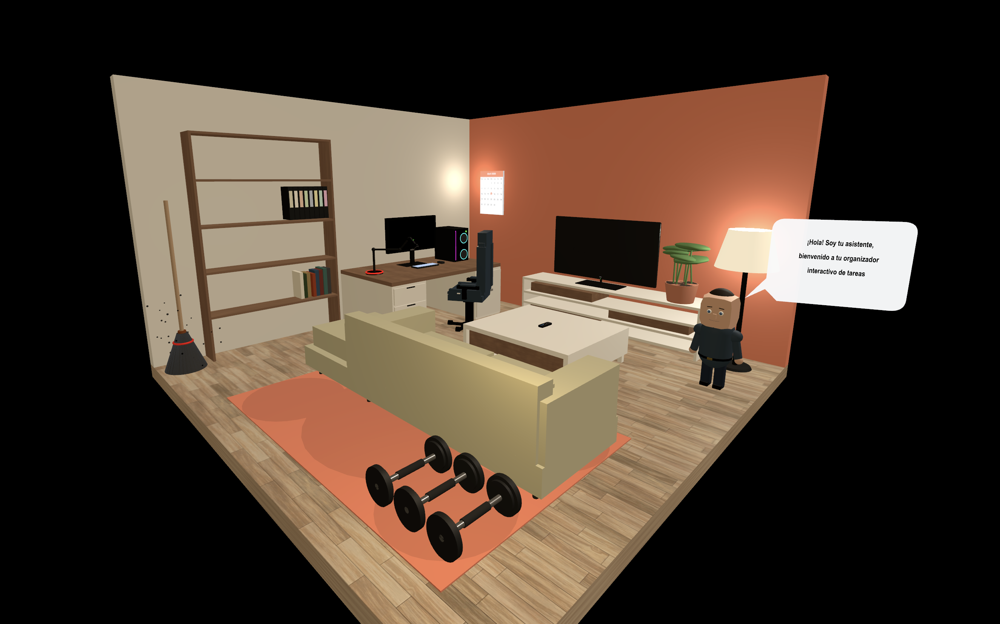

# TheTimeRoom

## Introducing Immersive 3D Habit Tracking Experience 🚀

 

### 🎯 The Problem We Solve
Traditional habit trackers and productivity dashboards rely on flat tables and utilitarian graphs which often suffer from low user retention. **TheTimeRoom** reinvents habit tracking by providing an immersive, gamified 3D virtual environment. By intuitively associating daily real-world activities with interactive 3D objects, this application significantly enhances user engagement, encourages regular self-reporting, and provides a continuous sense of visual progression.

### ✨ Key Features & Deliverables
- **Immersive 3D Interactions**: Users log their activities by interacting directly with associated 3D objects in their virtual room (e.g., *Bookshelf* for reading, *Dumbbells* for exercise, *Computer* for work/study, *Broom* for cleaning).
- **Dynamic Visual Progression**: The environment automatically evolves based on the user's tracked data. For example, as a user accumulates more exercise hours, additional workout equipment appears in the room, supplying immediate visual positive reinforcement.
- **Actionable Insights & Analytics**: Every interaction dynamically calculates and presents total activity hours, tracks the time since the last active session, and breaks down time spent by customizable categories.
- **Spatial Calendar Integration**: A fully integrated 3D calendar panel seamlessly links daily schedules and logged histories within the same spatial context.

This effectively turns mundane task management into a playful, rewarding spatial experience.

---

## Project Setup

```sh
npm install
```

### Compile and Hot-Reload for Development

```sh
npm run dev
```

